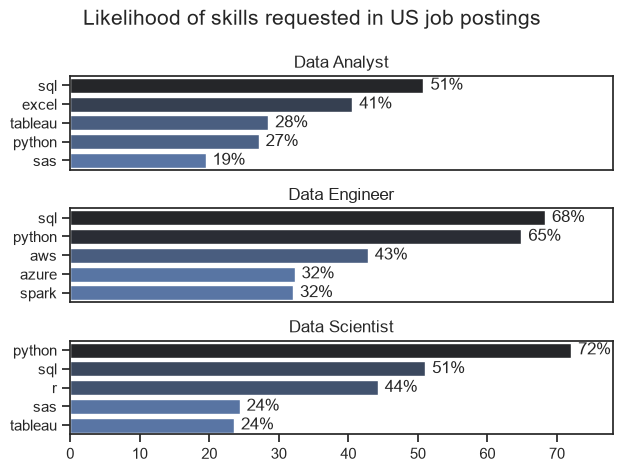
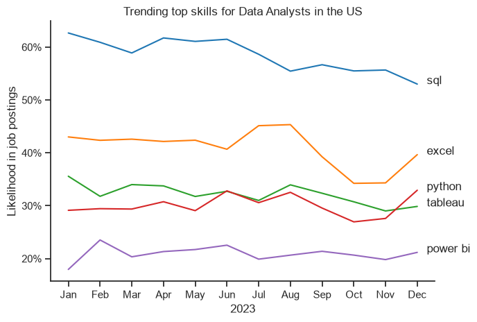
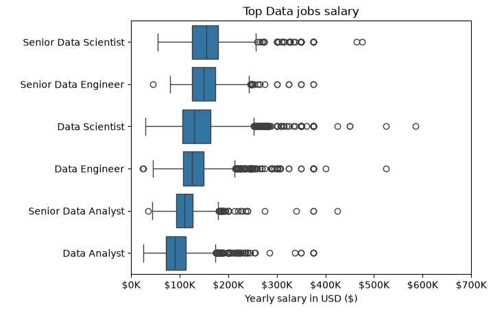
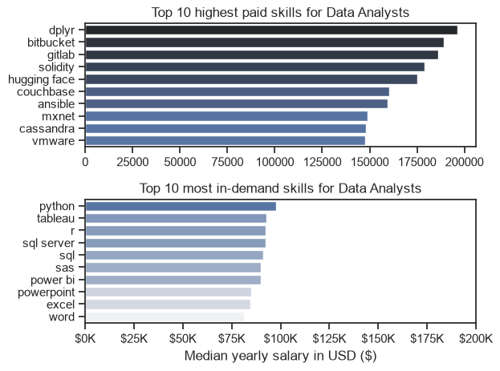
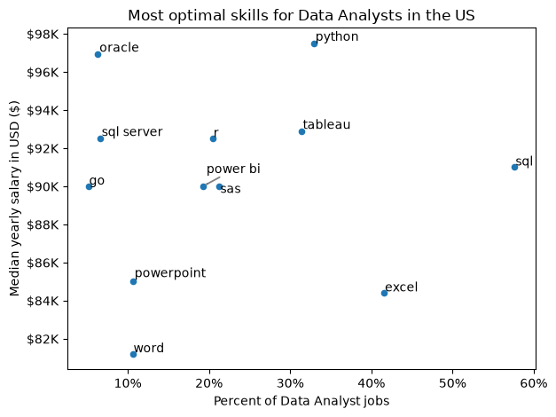
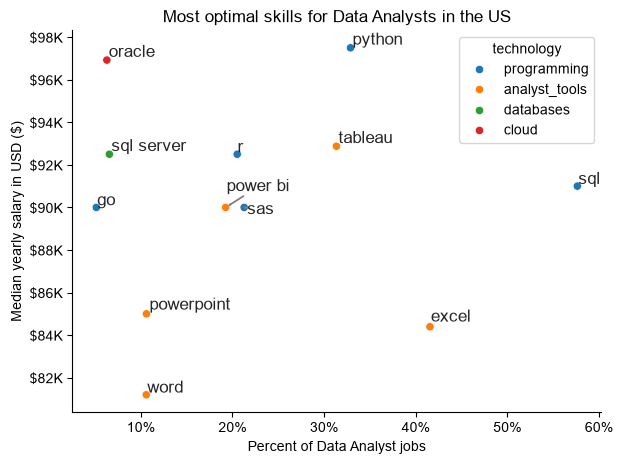

# Overview

Welcome to my analysis of the Data job market, focusing mainly on Data Analyst roles. I built this project to practice everything I'd learned in Python on a real dataset, and to actually understand the job market I'm trying to break into rather than just guessing statistics at it. It looks at the most in-demand skills, how skill demand shifts from month to month, and where the money actually is for Data Analysts.

The data comes from [Luke Barousse's Python Course](https://lukebarousse.com/python), which provided the `lukebarousse/data_jobs` dataset containing job titles, salaries, locations, and required skills for thousands of real postings. Using Python, I explore what skills show up most often, how that demand changes over the year, what these jobs and skills actually pay, and where demand and salary overlap.

# The Questions

Below are the questions I wanted to answer in this project:

1. What are the skills most in demand for the top 3 most popular Data roles?
2. How are in-demand skills trending for Data Analysts?
3. How well do jobs and skills pay for Data Analysts?
4. What are the optimal skills for Data Analysts to learn? (High demand and high paying)

# Tools I Used

For this project, I used:

- **Python:** the core of the analysis. I mainly worked with:
  - **Pandas** - cleaning, filtering, grouping, and reshaping the data
  - **Matplotlib** - building the initial charts
  - **Seaborn** - for the polished versions of the charts, once I moved past the plain Matplotlib output
- **Jupyter Notebooks** - ran everything here so I could keep code, notes, and charts together as I went
- **Visual Studio Code** - where I actually wrote and ran the notebooks
- **Git & GitHub** - version control and hosting the project

# Data Preparation and Cleanup

Before any of the actual analysis, I loaded the dataset and cleaned up two columns that weren't usable in their raw form.

## Import & Clean Up Data

```python
# Importing libraries
import pandas as pd
import matplotlib.pyplot as plt
from datasets import load_dataset
import ast
import seaborn as sns

# Loading data
dataset = load_dataset('lukebarousse/data_jobs')
df = dataset['train'].to_pandas()

# Data clean up
df['job_posted_date'] = pd.to_datetime(df['job_posted_date'])
# this date column was type str, now changed to type datetime

df['job_skills'] = df['job_skills'].apply(lambda x: ast.literal_eval(x) if pd.notna(x) else x)
# converting string formatted list to actual list
```

The `job_posted_date` column came in as str text, so I converted it to an actual datetime object - otherwise I couldn't group by month later. The `job_skills` column looked like a list (`['Python', 'SQL']`) but was actually stored as a string, so `ast.literal_eval` was needed to turn it back into a real Python list I could explode and count on it.

## Filter US Jobs

Most of my analysis focuses on the US job market specifically, so I filtered down early:

```python
df_us = df[df['job_country'] == 'United States']
```

# The Analysis

Each notebook in this project tackles one of the four questions above.

## 1. What are the most demanded skills for the top 3 most popular data roles?

To answer this, I exploded the `job_skills` column so each skill got its own row, grouped by skill and job title, and counted how often each skill showed up. Then I converted those raw counts into percentages (skill count ÷ total postings for that role), so the roles were comparable even though they have different numbers of postings.

View my notebook here: [2_Skill_Demand.ipynb](./2_Skill_Demand.ipynb)

### Visualize Data

```python
fig, ax = plt.subplots(len(job_titles), 1)
sns.set_theme(style='ticks')

for i, job_title in enumerate(job_titles):
    df_plot = df_skills_perc[df_skills_perc['job_title_short'] == job_title].head()
    sns.barplot(data=df_plot, x='skills_percent', y='job_skills', ax=ax[i], hue='skill_count', palette='dark:b_r')
    ax[i].legend().set_visible(False)
    ax[i].set_ylabel('')
    ax[i].set_xlabel('')
    ax[i].set_xlim(0, 78)
    ax[i].set_title(job_title)

    for n, v in enumerate(df_plot['skills_percent']):
        ax[i].text(v + 1, n, f'{v:.0f}%', va='center')

    if i != len(job_titles) - 1:
        ax[i].set_xticks([])

fig.suptitle('Likelihood of skills requested in US job postings', fontsize=15)
fig.tight_layout()
```

### Results



*Bar chart showing the top 5 skills for Data Analyst, Data Engineer, and Data Scientist roles, as a percentage of postings for each role.*

### Insights

- SQL shows up constantly - it's the top skill for Data Analysts (51%) and the top skill for Data Engineers (68%), and still lands second for Data Scientists (51%). If I only had time to learn one thing, it'd be this.
- Python is the clear anchor skill for Data Scientists, appearing in 72% of postings, and it's also strong for Data Engineers (65%). For Data Analysts it's lower (27%), sitting behind SQL and Excel.
- Data Analyst roles lean on more general tools - Excel (41%) and Tableau (28%) - while Data Engineer roles want more specialized infrastructure skills like AWS (43%), which makes sense given the difference in what each role actually does day to day.

## 2. How are in-demand skills trending for Data Analysts?

Here I filtered down to just Data Analyst postings in the US, pulled out the month each job was posted, and grouped skill counts by month. I converted those counts to a percentage of that month's total postings so the trend wasn't just reflecting more/fewer job postings overall.

View my notebook here: [3_Skills_Trend.ipynb](./3_Skills_Trend.ipynb)

### Visualize Data

```python
sns.lineplot(data=df_plot, dashes=False, palette='tab10')
sns.set_theme(style='ticks')
sns.despine()

plt.title('Trending top skills for Data Analysts in the US')
plt.xlabel('2023')
plt.ylabel('Likelihood in job postings')
plt.legend().remove()
plt.tight_layout()

from matplotlib.ticker import PercentFormatter
ax = plt.gca()
ax.yaxis.set_major_formatter(PercentFormatter(decimals=0))

from adjustText import adjust_text
texts = []
for column in df_plot.columns:
    texts.append(plt.text(df_plot.index[-1], df_plot[column].iloc[-1], column))
adjust_text(texts)
```

### Results



*Line chart tracking the top 5 skills for Data Analysts month by month across 2023.*

### Insights

- SQL stayed the most requested skill all year, but it did trend downward - from around 63% in January to about 52% by December.
- Excel dipped mid-year but climbed sharply from October onward, ending the year as the second most requested skill by a wide margin.
- Python and Tableau tracked each other closely for most of the year, crossing back and forth, while Power BI stayed consistently the least requested of the top 5 - though it held steady rather than dropping off.

## 3. How well do jobs and skills pay for Data Analysts?

First I looked at the salary distributions across the top 6 data job titles overall (not just Data Analyst) to see how the role compares to others. Then I narrowed in on just Data Analyst postings and compared the highest-*paying* skills against the most *in-demand* skills - since those turned out to be two very different lists.

View my notebook here: [4_Salary_Analysis.ipynb](./4_Salary_Analysis.ipynb)

### Visualize Data

```python
sns.boxplot(data=df_us_top6, x='salary_year_avg', y='job_title_short', order=job_order)

plt.title('Top Data jobs salary')
plt.xlabel('Yearly salary in USD ($)')

ax = plt.gca()
ax.xaxis.set_major_formatter(plt.FuncFormatter(lambda x, pos: f'${int(x/1000)}K'))
plt.xlim(0, 700000)
plt.ylabel(' ')
```

### Results



*Box plot comparing salary distributions across the top 6 data job titles in the US.*

### Insights

- Senior Data Scientist has both the highest median salary and the widest spread of the six roles, with a long tail of outliers reaching past $500K.
- Data Analyst has the tightest, most predictable salary range of the six - fewer extreme outliers than the more senior/specialized roles, which tracks with it being the more entry-level position.
- Salary and seniority move together, but so does the *variance* - Senior roles don't just pay more on average, they also have a much wider range of outcomes.

#### Highest Paid & Most In-Demand Skills for Data Analysts

```python
fig, ax = plt.subplots(2, 1)

sns.barplot(data=df_us_da_toppay, x='median', y=df_us_da_toppay.index, ax=ax[0], hue='median', palette='dark:b_r')
sns.barplot(data=df_us_da_skills, x='median', y=df_us_da_skills.index, ax=ax[1], hue='median', palette='light:b')
```



*Two bar charts comparing the top 10 highest-paid Data Analyst skills against the top 10 most in-demand ones.*

### Insights

- The highest-paid skills (dplyr, Bitbucket, GitLab, Solidity) are barely ever asked for - they're niche, but pay close to $200K when they do show up.
- The most in-demand skills (Python, Tableau, R, SQL, Excel) pay noticeably less, closer to $85K–$100K, and none of them overlap with the highest-paid list at all.
- This was the clearest signal in the whole project: demand and pay aren't the same thing. A skill being common doesn't mean it pays the most, and a skill paying the most doesn't mean anyone's actually asking for it.

## 4. What are the most optimal skills to learn for Data Analysts?

To pull the last two questions together, I combined skill demand percentage and median salary into one view, then filtered down to only skills appearing in more than 5% of postings - so I wasn't looking at one-off outlier skills that only had a handful of postings.

View my notebook here: [5_Optimal_Skills.ipynb](./5_Optimal_Skills.ipynb)

### Visualize Data

```python
from adjustText import adjust_text

df_skills_high.plot(kind='scatter', x='skill_percent', y='median_salary')
plt.title('Most optimal skills for Data Analysts in the US')
plt.xlabel('Percent of Data Analyst jobs')
plt.ylabel('Median yearly salary in USD ($)')

from matplotlib.ticker import PercentFormatter
ax = plt.gca()
ax.xaxis.set_major_formatter(PercentFormatter(decimals=0))
ax.yaxis.set_major_formatter(plt.FuncFormatter(lambda y, pos: f'${int(y/1000)}K'))

texts = []
for i, txt in enumerate(df_skills_high.index):
    texts.append(plt.text(df_skills_high['skill_percent'].iloc[i], df_skills_high['median_salary'].iloc[i], txt))
adjust_text(texts)
```

### Results



*Scatter plot of skill demand (x-axis) against median salary (y-axis) for Data Analyst skills appearing in more than 5% of postings.*

### Insights

- Python sits in the best spot on the whole chart - it's both in the top tier for salary (~$97K) and shows up in about a third of postings, so it's genuinely worth the time investment.
- SQL is the most in-demand skill by far (over 55% of postings) but sits in the middle of the pack for salary, confirming what I found in question 3 - being common doesn't mean being well paid.
- Oracle stood out as the highest-paying skill on this chart despite fairly low demand, which lines up with the "rare but well-paid" pattern from the previous question.

### Visualizing Different Technologies

I then added color-coding by technology category (programming, analyst tools, databases, cloud) to see if any category clustered toward higher pay.

```python
sns.scatterplot(
    data=df_plot,
    x='skill_percent',
    y='median_salary',
    hue='technology'
)
```



*Same scatter plot as above, with points colored by technology category.*

### Insights

- Programming skills (Python, SQL, R, Go) cluster toward the top of the salary range compared to analyst tools - actual coding ability seems to carry a real premium over just knowing a BI tool.
- Database skills like Oracle and SQL Server land among the highest-paid points on the whole chart, even with fairly modest demand - a smaller, more specialized crowd knows these.
- Analyst tools (Excel, PowerPoint, Word, Tableau, Power BI) dominate the high-demand, lower-salary corner of the chart - useful for actually getting hired, but not what pushes salary up on their own.

# What I Learned

This project was my first time working with a real dataset from start to finish. A few things that actually stuck:

- **Data cleaning comes first, always.** The date and skills columns looked fine at a glance but were completely unusable until converted - I hit `ast.literal_eval` errors, `.dt` accessor errors, and chained-assignment bugs before I got this right.
- **`explode()` and pivot tables are the backbone of this kind of analysis.** Almost every question came down to: explode the skills list into rows, then pivot/group to count or average.
- **Percentages beat raw counts almost every time.** Comparing raw skill counts across job titles or months was misleading since posting volume itself changes - converting to a percentage of that group's total was the fix, and I had to relearn this every time I forgot it.
- **Debugging matplotlib label overlap** taught me `adjustText` exists and is worth reaching for anytime chart labels collide, instead of manually nudging coordinates by trial and error.

# Insights

Looking across all four questions together:

- **Demand and salary are two separate axes, not one.** The skills everyone asks for (SQL, Excel) aren't the skills that pay the best (Oracle, dplyr, GitLab), and vice versa. The real strategy is finding the overlap — which is exactly what Python turned out to be for Data Analysts.
- **Skill demand isn't static.** SQL trended down over the year while Excel spiked at the end - a snapshot from any single month would have given a misleading picture.
- **Programming ability carries a real salary premium** over tool-only skills, even within the same job title.

# Challenges I Faced

- **Chained assignment and copy-vs-view bugs.** I hit `SettingWithCopyWarning` more than once, and one chained assignment (`df = df['col'] = value`) actually broke a DataFrame into a Series and caused a recursion error when I tried to print it.
- **Type conversion after cleaning.** Dropping missing values didn't automatically convert columns back from float to int - something I had to explicitly fix with `.astype(int)` each time.
- **Getting labels readable on crowded charts.** My first attempt at labeling the skills-trend line chart had names overlapping into unreadable text, and I doubled labels by accidentally leaving two separate labeling loops in the same cell before catching it.

# Conclusion

This project took me from "I know Pandas syntax" to actually using it to answer real questions about a real job market - and the biggest lesson wasn't a syntax one, it was realizing that demand and pay don't move together. For me specifically, it reinforced that SQL and Python are worth prioritizing, since they're the rare skills that are both commonly asked for and well paid. I'll be applying the same workflow (clean → explode/group → visualize → find the story) again once I move on to Power BI or Tableau next.
